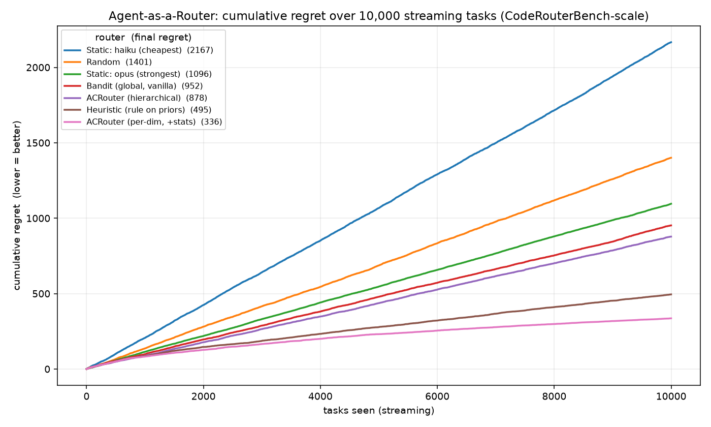

# Agent-as-a-Router (ACRouter)

[](https://github.com/loversky02/Agent-as-a-Router/actions/workflows/ci.yml) [](https://arxiv.org/abs/2606.22902) 

A learning router for coding models, built from the paper
[*Agent-as-a-Router* (arXiv:2606.22902)](https://arxiv.org/abs/2606.22902).



> Cumulative regret over a 10k-task stream (lower is better). The learning router
> (**ACRouter, per-dim +stats** — pink, bottom) keeps making fewer routing mistakes
> as it runs, while static baselines accrue regret linearly — the thesis in one
> picture. Regenerate with `python scripts/run_demo.py 10000`.

Most routers pick a model with a **static, one-off classification**. The paper's
insight is that the real bottleneck is an **information deficit**: the router never
learns which model is actually good at which *kind* of task. ACRouter reframes
routing as a loop that accumulates execution-grounded experience:

```
Context  ->  Action  ->  Feedback  ->  Context'
featurize    pick a       score the     update per-dimension
the task     model &      outcome       stats -> better next
+ stats      run it       (tests/cost)  decision
```

It is, underneath, a **contextual bandit**: arms = models, reward = cost-adjusted
correctness, metric = **cumulative regret** over a streaming task sequence.

## Quickstart (offline, free, no API key)

```bash
python scripts/run_demo.py          # mock backend simulates models + tests
```

You'll see a streaming, regret-based comparison of routing strategies, e.g.:

```
strategy                          accuracy  avg_reward     cost  cum_regret
Static: haiku (cheapest)            45.7%       0.442      200       851.5
Static: opus (strongest)            85.0%       0.549     4000       441.1
Bandit (global, vanilla)            67.6%       0.572     1394       380.8
ACRouter (per-dim, +stats)          73.5%       0.605     1742       200.1   <- best learner
Oracle (zero-regret floor)          80.2%       0.659     1918         0.0

>> Task-dimension stats cut cumulative regret by +47.4% vs the vanilla router.
```

The headline reproduces the paper's central finding in miniature: **the only
difference between the two bandits is whether they keep per-task-dimension
statistics**, and that alone is what separates near-oracle routing from a mediocre
compromise. (Magnitude here exceeds the paper's +15.3% because the synthetic
environment has strong per-dimension structure; the *direction* is the point.)

## How the code maps to the paper

| Module | Role in the C→A→F→C loop | Paper concept |
|---|---|---|
| `src/featurizer.py` | **Context**: task → dimensions | task-dimension features |
| `src/experience.py` | persistent per-(dim×model) Beta stats | "performance statistics", the memory |
| `src/policies.py` | **Action**: pick an arm (Thompson) | the router policy |
| `src/providers.py` | execute on the chosen model | the model pool (8 frontier LLMs) |
| `src/verifier.py` | **Feedback**: pass/fail + reward | verified scores |
| `src/router.py` | one full loop turn (`step`) | ACRouter |
| `src/loop.py` + `src/eval.py` | streaming regret evaluation | CodeRouterBench |

## Project layout

```
src/config.py      model pools (Claude ladder / multi-provider / local), λ, backend
src/providers.py   Provider interface + MockProvider (offline) + ClaudeProvider (real)
src/featurizer.py  task -> (language, type, difficulty) dimension key
src/experience.py  SQLite Beta(α,β) store per (dimension, model)
src/policies.py    Static / Random / EpsilonGreedy / ThompsonSampling / Oracle
src/verifier.py    pass/fail scoring + cost-aware reward
src/router.py      ACRouter.step() — the Context→Action→Feedback→Context turn
src/loop.py        run a task stream, log reward + cumulative regret
src/eval.py        compare strategies, print table + regret sparkline, save regret.png
src/tasks.py       synthetic task stream (swap for HumanEval / MBPP / SWE-bench)
scripts/run_demo.py  entry point
```

## Roadmap — the three goals, one growing system

The demo above is the foundation. Each goal layers on without rework:

- **Learning demo (done)** — the offline mock loop + regret curve above.
- **Reproduce the paper** — swap `src/tasks.py` for a real benchmark loader
  (HumanEval / MBPP / BigCodeBench), and `verifier.verify` for real unit-test
  execution. Keep the same regret eval. Validate the +stats gain on real data.
- **Practical tool** — set `config.BACKEND="real"`, wire `ClaudeProvider` (and add
  OpenAI/Ollama Providers behind the same interface), then wrap `ACRouter.step` in a
  FastAPI OpenAI-compatible endpoint so it drops into existing coding tools. The
  Experience Store already persists, so it keeps learning in production.

### Switching model pools

Edit `src/config.py`: `POOL = CLAUDE_POOL` → `MULTI_POOL` or `LOCAL_POOL`. Every
pool is just a list of `ModelSpec`s behind the same Provider interface.

## Going from mock to real — the 3 extension points

1. **Providers** (`src/providers.py`): `ClaudeProvider` is implemented; add
   `OpenAIProvider` / `OllamaProvider` mirroring its interface.
2. **Verifier** (`src/verifier.py`): replace the mock pass/fail with running the
   task's tests, or an LLM-as-judge when there are no tests.
3. **Tasks** (`src/tasks.py`): replace `make_stream` with a loader that yields the
   same `Task` shape from a real coding benchmark.

## Design tensions worth knowing (the paper's real subject)

- **Cold start** — Thompson sampling explores automatically via posterior variance.
- **Dimension granularity** — too fine → sparse stats, slow learning; too coarse →
  weak signal. Tune the key in `featurizer.py`.
- **Reward without tests** — fall back to an LLM-judge; partial credit.
- **Non-stationarity** — models/prompts drift; add posterior decay / sliding window.
- **Credit assignment** — multi-step agentic tasks are harder to score than one-shot.

## Reproduce on real MBPP tasks

```bash
python scripts/fetch_mbpp.py        # downloads sanitized MBPP -> data/mbpp.json
python scripts/run_mbpp.py 30       # offline: proves the real test executor works
```

`scripts/run_mbpp.py` runs the **real** verifier (`src/sandbox.py` executes generated
code against each problem's `assert` tests in a subprocess). With no API key it runs a
*self-test* — pushing MBPP reference solutions through the executor to prove the
harness end-to-end for free. To route **real** models, see the next section.

## Run live against an OpenAI-compatible gateway

Point the router at any `/v1` gateway (a self-hosted **9router**, OpenAI, etc.). Copy
`.env.example` to `.env` (gitignored) and fill in `OPENAI_API_KEY`, `OPENAI_BASE_URL`,
and `ACROUTER_ROUTER_MODEL`. Then flip the pool/backend **per run** — the committed
defaults stay offline, so this never affects the demo or CI:

```bash
# real Claude models solve MBPP tasks, with real test verification + routing
ACROUTER_POOL=ninerouter ACROUTER_BACKEND=real python scripts/run_mbpp.py 6

# the LLM-as-Router brain makes real routing calls (providers stay mock -> ground-truth regret)
python scripts/compare_routers.py 12 --live
```

`config.NINEROUTER_POOL` is the real Claude ladder (`cc/claude-haiku-4-5` →
`sonnet-4-6` → `opus-4-8`) and `OpenAIProvider` speaks the OpenAI chat API. Verified
live: a 6-task MBPP slice routed to real haiku/sonnet returned **100% pass** with real
subprocess test execution.

## Serve as an OpenAI-compatible proxy

```bash
uvicorn src.server:app --reload     # runs on the mock backend by default
```

```bash
# route a coding request — the router picks the model
curl -s localhost:8000/v1/chat/completions -H 'content-type: application/json' \
  -d '{"messages":[{"role":"user","content":"write a python function to reverse a string"}]}'
# -> returns OpenAI-shaped JSON; `x_router` tells you which arm + candidate stats

# close the loop: report whether the answer worked
curl -s localhost:8000/v1/feedback -H 'content-type: application/json' \
  -d '{"id":"<id from above>","success":true}'

curl -s localhost:8000/stats        # inspect accumulated per-dimension experience
```

The proxy persists experience to `data/experience_server.sqlite`, so it keeps learning
across restarts — routing as an agentic process that updates its priors as it runs.

## LLM-as-Router (the "Agent" in Agent-as-a-Router)

`LLMRouterPolicy` (in `src/policies.py`) is a drop-in alternative to Thompson
sampling: instead of a bandit formula, it hands the **retrieved per-dimension stats**
to an LLM and asks it to pick an arm and explain why (`policy.last_rationale`). It
takes an injectable `complete_fn`, so you can unit-test it offline with a stub or wire
it to Claude for the real thing. Swap it into any `ACRouter(...)` in place of
`ThompsonSampling`.

Compare the two decision-makers head-to-head on the same stream:

```bash
python scripts/compare_routers.py            # offline, free (greedy stub brain)
python scripts/compare_routers.py 60 --live  # real Claude routing (needs API key)
```

## More of the paper, built out

Beyond the core loop, these implement the rest of what the paper raises:

**Non-stationarity (drift).** The Experience Store supports `decay<1` (exponential
forgetting) so the router tracks a changing world.
```bash
python scripts/run_drift.py     # regime flips mid-stream; the forgetting router adapts faster
```

**Out-of-distribution generalization.** `HierarchicalThompson` + `ACRouter(hierarchical=True)`
keep multi-resolution priors (global → task-type → dimension). For a brand-new
dimension, coarser priors transfer instead of cold-starting.
```bash
python scripts/run_ood.py       # train on simple tasks, route unseen 'agentic' tasks
```

**Heuristic-router baseline.** `HeuristicPolicy` is a fixed escalation rule over the
same priors — the baseline the paper's learned, stats-augmented router beats. It is a
row in `python scripts/run_demo.py` (ACRouter posts lower regret at lower cost).

**Vanilla vs. stats-augmented LLM router (the +15.3% experiment).**
`LLMRouterPolicy(..., use_stats=False)` is the "vanilla" router that sees only the
task; `use_stats=True` adds the retrieved per-dimension statistics — the exact
contrast behind the paper's headline number.

**8-model pool.** `config.EIGHT_POOL` simulates eight cost/skill-tiered models, closer
to the paper's eight-LLM setup. Set `POOL = EIGHT_POOL` in `src/config.py`.

**SWE-bench Lite loader.** `benchmarks.load_swebench_lite` reads SWE-bench Lite
instances as agentic OOD routing tasks (executing them needs the official Docker
harness — out of scope; the loader is for routing/generalization experiments).

## Tests

```bash
pytest        # or: python -c "import pytest, sys; sys.exit(pytest.main())"
```

28 tests lock in the verified behaviors — the sandbox executor, featurizer
classification (incl. the python-vs-javascript regression), Beta posterior updates and
decay, the LLM router's parsing/fallback, the proxy endpoints, drift adaptation, OOD
transfer, and the paper's central claim itself: `test_per_dimension_stats_reduce_regret`
asserts that per-dimension statistics beat a stats-less bandit.
```
